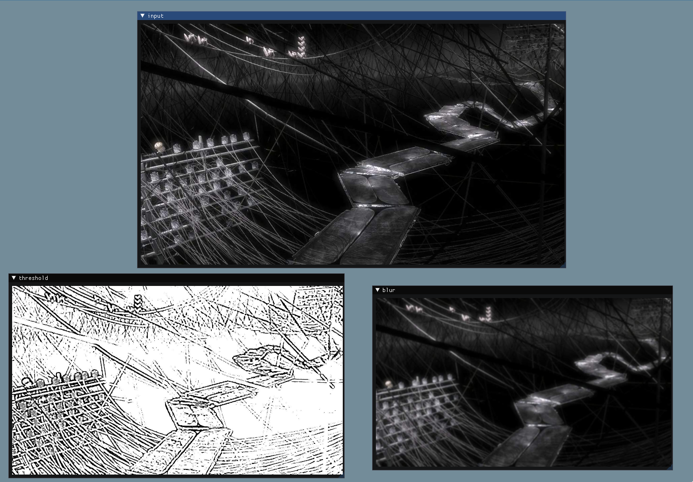

# Frame streamer

Copyright (c) 2022 [Antmicro](https://www.antmicro.com)

A minimalistic library to stream frames from e.g. embedded devices.

When working on image processing flows, especially on embedded devices, it is crucial to analyze the intermediate results. However, on embedded devices, it may be uncomfortable.

The library allows sending frames to a remote application, working on the host, to quickly analyse and debug such processing flows. Of course, it's only one of the possible usages.



----

## Building the project

The project requires [OpenCV](https://opencv.org/releases/), [OpenGL](https://www.khronos.org/opengl/wiki/Getting_Started#Downloading_OpenGL), [glfw3](https://www.glfw.org/download) and a C++ compiler with C++20 support (g++-12 is recommended). 

To build the project, go to its root directory and execute:
```
cmake -s . -B build
```

## Running the demo
The project consists of a streaming library and receiving application. They communicate with each other using UDP protocol.

### Server
After the successful build, you can run the demo inside the `build` directory. E.g.:
```
./server 127.0.0.1
```

This will start the server, streaming frames to your localhost on the default port (1100). By default `/dev/video0` is taken as a stream source.

By default, the server sends frames in jpg format, with a quality factor of 95. To use e.g. png format with compression 4, add `-e .png -q 4` to the runtime parameters.

You can find more information about available arguments in command-line help:
```
./server --help
```

### Client
To receive and display the frames, you have to run the client:
```
./client
```

After a successful run, the window with named streams should appear.


By default, the client will use port 1100, and receive messages from all available interfaces.

You can also find more information about available arguments in command-line help:
```
./client --help
```

## Usage
The core of the library are the `FrameSender` and `FrameReceiver` classes. They both derive from `UdpInterface`.

### Send frames
You can use `FrameSender` in your program for the embedded device (server). 

First, you should create an instance of the frame sender class:
```c++
#include <framestreamer/framesender.hpp>
FrameSender streamer = FrameSender("196.168.1.15", 1111);
```
Where `196.168.1.15` is the client address and `1111` – his IP port. The constructor is also responsible for creating the socket.

To send a frame under the name "my_stream" use:

```c++
streamer.sendFrame(frame, "my_stream");
```
Where frame is a [cv::Mat](https://docs.opencv.org/4.x/d3/d63/classcv_1_1Mat.html). To match the client side, the frame should be sent as grayscale or BGR. We've chosen BGR because it's common in OpenCV.

This will send the frame as a jpg with quality 95. You can send it in other formats, providing the next arguments. E.g. to send it as a png with compression 4, use:

```c++
streamer.sendFrame(frame, "my_stream", ".png", cv::IMWRITE_PNG_COMPRESSION=4);
```
[Here](https://docs.opencv.org/3.4/d4/da8/group__imgcodecs.html#ga288b8b3da0892bd651fce07b3bbd3a56) you can find more information about supported formats.

To ensure continuity of the stream, use the same name for each frame in it.

#### Technical details
To send the frame, we must encode it and check if it fits the datagram. If not, it's split into parts. Each frame has an id and number of parts. Each part also has a separate id. The whole structure of the message is available in [`udpinterface.hpp`](include/framestreamer/udpinterface.hpp) file as `FrameMessage`. Then the message is sent to the client, which we assigned when creating the instance of `FrameSender`.


### Receive frames

The receiver is on the client side. Here we have to join the parts of the frame back together and keep the frames in order.

To receive the frame, create an instance of the `FrameReceiver`:
```c++
#include "framestreamer/framereceiver.hpp"
FrameReceiver receiver = FrameReceiver();
```
Without arguments, it binds the socket to all available interfaces, with default port 1100. You can of course provide the client IP address and port.

Then fetch the frame:
```c++
Frame frame = receiver.receiveFrame();
```
The function returns a `Frame` structure with two fields: `name` (the stream name) and `img` (cv::Mat with the image).

You can then display the frame however you want. E.g.:
```c++
#include <opencv2/highgui.hpp>

cv::namedWindow(frame.name, cv::WINDOW_AUTOSIZE); // Create a window
cv::imshow(frame.name, frame.img); // Show image in it
cv::waitKey(0);                // Wait for a keypress before closing the window
```

#### Technical details
`receiveFrame` is a loop, which receives parts of frames from various streams and joins them until any of the frames is complete (has all parts).

To keep the frames in order, we've created a mapping from a stream name to a linked list of `FrameContainer`s with all of the stream frames. It's worth noticing, that the frames in the stream are mostly incomplete because when any of them is complete, we return it immediately. Frames in the list are sorted by id.

When a new part of the frame comes, firstly we find the stream to which it belongs (by name). Then we look at the frame id and (like in insertion sort) look for a proper place for it. Then we copy the data from the frame part to the place where they should be in the actual frame. Since the ids can overflow, the algorithm assumes that when e.g. frame with id 0 comes after 4294967295, it should be placed at the end to ensure stream continuity.

When the frame is complete, we delete all incomplete frames before it (because we have a newer one), decode it and return its name and image (in a `Frame` structure).

[The client program](src/client.cpp) uses [Dear ImGui](https://github.com/ocornut/imgui) to display frames. The program has two threads. One is responsible for receiving frames and the main one – for displaying them. They communicate via a map with stream names and their most recent frames.

When the receiver thread receives a new frame, it puts it in the map, changing the most recent image.

When the main thread notices that the frame is changed, it reloads the texture assigned to the frame and the displayed image changes. [Here](https://github.com/ocornut/imgui/wiki/Image-Loading-and-Displaying-Examples) you can read more about how Dear ImGui displays photos.

## Licensing

The sources are published under the Apache 2.0 License, except for files located in the `third-party/` directory. For those files, the license is either enclosed in the file header or a separate LICENSE file.

The README video samples are created using Elephant's Dream, released under [Creative Commons Attribution](https://creativecommons.org/licenses/by/2.5/) license:

(c) copyright 2006, Blender Foundation / Netherlands Media Art Institute / www.elephantsdream.org
